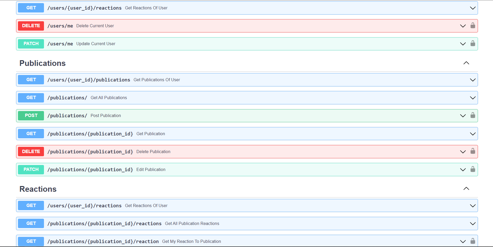

# Тестовое задание для компании Webtronics

## Быстрый старт

1. Склонируйте репозиторий и перейдите в папку проекта

```shell
git clone https://github.com/codenjoyer/blogpost.git
cd blogpost
```

2. Создайте виртуальное окружение и активируйте его

```shell
python -m venv venv
cd venv/Scripts
activate
```

3. Перейдите в папку проекта

```shell
cd ../..
```

4. Установите зависимости

```shell
pip install -r requirements.txt
```

5. **Создайте** файл .env и заполните по примеру файла dev.env


6. Перейдите в папку src

```shell
cd src
```

7. Проведите миграции

```shell
alembic upgrade head
```

8. Запустите приложение

```shell
uvicorn main:app --reload
```

Теперь приложение доступно по адресу http://localhost:8000/, а документация к нему и доступ ко всем эндпоинтам - http://localhost:8000/docs

## Описание

Небольшое приложение, социальная сеть, с базовой реализацией REST API. Есть авторизация, возможность создания
публикаций и реагирования на них.





## Технологии

- Python 3.11
- FastAPI
- FastAPI-Users
- SQLite 3
- Aiosqlite
- SQLAlchemy
- Alembic